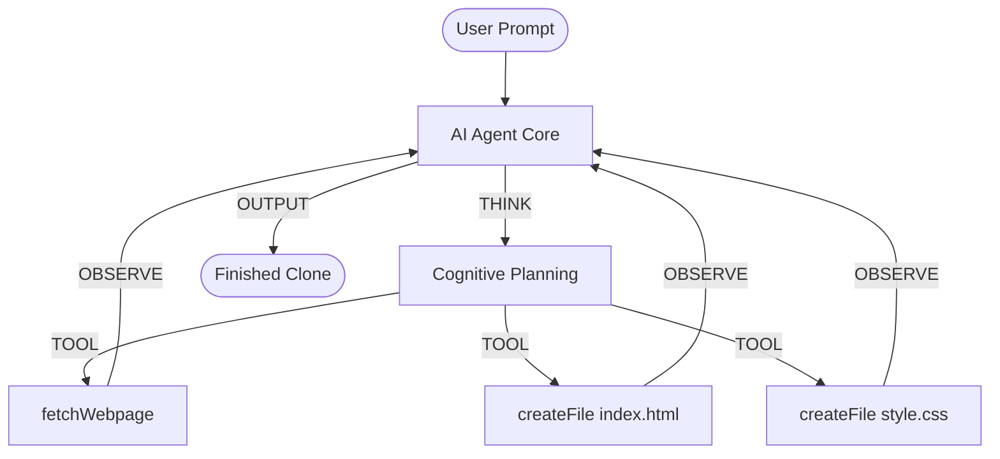

<div align="center">
  <h1>🤖 AI Agent CLI (Website Cloner)</h1>
  <p>An autonomous, conversational CLI agent powered by <strong>Gemini 2.5 Flash</strong> that clones websites with high fidelity.</p>
  
  
  
  
</div>

---

## ✨ Features

- **Autonomous Agentic Loop:** Operates on a strict `START → THINK → TOOL → OBSERVE → OUTPUT` cognitive loop.
- **High-Fidelity Cloning:** Uses Puppeteer to intelligently scrape real DOM content, heading hierarchies, class frequencies, and CSS design tokens (colors, fonts).
- **Zero Hallucination Generation:** Strictly enforced system prompts ensure the AI uses *real* scraped data instead of placeholders like "Lorem Ipsum".
- **API Key Auto-Rotation:** Built-in resilient error handling that automatically cycles through multiple API keys to bypass rate limits (429) or bans (403).
- **1M Token Context:** Leverages Gemini's massive context window to feed entire page structures without aggressive pruning.

## 🏗️ Architecture Flow



## 🛠️ Installation & Setup

1. **Clone the repository and install dependencies:**
   ```bash
   git clone https://github.com/arnav-yadav/AIAgentCLI.git
   cd AIAgentCLI
   npm install
   ```

2. **Configure Environment Variables:**
   Get a free Gemini API key from [Google AI Studio](https://aistudio.google.com/apikey).

   ```bash
   # Add your primary key
   echo "GEMINI_API_KEY=your_key_here" > .env
   
   # Optional: Add multiple keys for auto-rotation
   echo "GEMINI_API_KEY_1=second_key_here" >> .env
   echo "GEMINI_API_KEY_2=third_key_here" >> .env
   ```

3. **Run the Agent:**
   ```bash
   node index.js
   ```

## 🧰 Available Tools

The agent is strictly restricted to these custom functions to prevent hallucinated shell executions:

| Tool | Capability |
|------|-------------|
| 🌐 `fetchWebpage(url)` | Headless Puppeteer scraper that extracts page text, headings, links, CSS colors/fonts/backgrounds, and top class names. |
| ✍️ `createFile(path, content)` | Writes generated HTML/CSS/JS files directly to the local disk. Creates directories automatically. |

## 💻 Example Usage

```text
╔══════════════════════════════════════════════════╗
║           🤖 AI Agent CLI (Gemini)               ║
║  Conversational AI that clones websites.         ║
╚══════════════════════════════════════════════════╝

You → Clone scaler.com

🚀 START  The user wants me to clone scaler.com...
💭 THINK  I need to scrape the website first...
🔧 TOOL → fetchWebpage ({"url":"https://www.scaler.com"})
   🌐 Launching browser to scrape...
   ✅ Scrape complete — extracted 50 headings, 72 links
👁 OBSERVE  {"pageTitle":"Scaler Academy"...}
💭 THINK  The primary colors are...
🔧 TOOL → createFile ({"filePath":"output/index.html"...})
   📄 Created: output/index.html
🔧 TOOL → createFile ({"filePath":"output/style.css"...})
   📄 Created: output/style.css
✅ OUTPUT  Done! Open output/index.html in your browser to view the clone.
```

## 🛡️ Error Handling
- **429 (Rate Limit) & 503 (High Demand):** Pauses for 10 seconds or immediately rotates to the next available API key.
- **403 & API_KEY_INVALID:** Automatically drops the banned key and rotates to the next valid key in the `.env` file.

---
*Built with ❤️ using the Gemini 2.5 SDK & Node.js*
